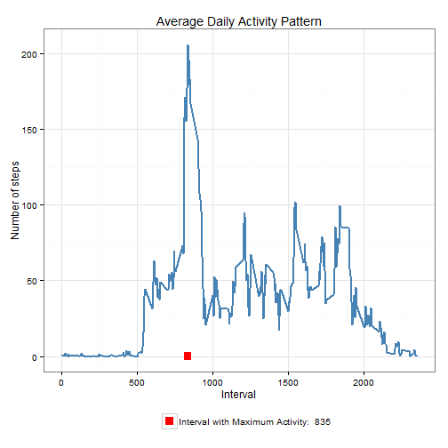
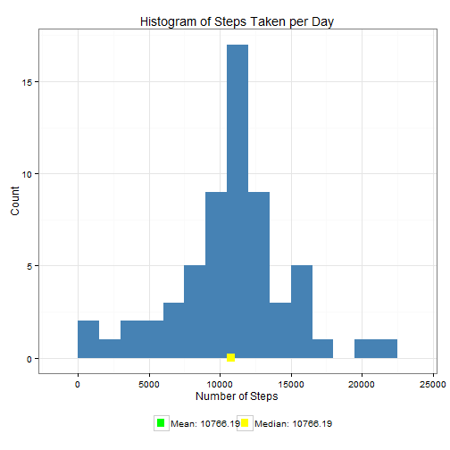

# Reproducible Research: Peer Assessment 1


## Loading and preprocessing the data
1. The data file is downloaded 
2. Unzip and read as a data frame.
3. The interval column is converted to factor type.
4. The date column is converted to Date type.


```r
library(ggplot2)  # I'm going to practice ggplot2
# download and read the data, convert columns for convenience
fname = "activity.zip"
source_url = "https://d396qusza40orc.cloudfront.net/repdata%2Fdata%2Factivity.zip"
download.file(source_url, destfile = fname)
```

```
FALSE Error: esquema de URL sin soporte
```

```r
# I don't know why this error ocurr. Locally in RStudio works.
con <- unz(fname, "activity.csv")
tbl <- read.csv(con, header = T, colClasses = c("numeric", "character", "numeric"))
tbl$interval <- factor(tbl$interval)
tbl$date <- as.Date(tbl$date, format = "%Y-%m-%d")
# if you want to see before analize
head(tbl)
```

```
FALSE   steps       date interval
FALSE 1    NA 2012-10-01        0
FALSE 2    NA 2012-10-01        5
FALSE 3    NA 2012-10-01       10
FALSE 4    NA 2012-10-01       15
FALSE 5    NA 2012-10-01       20
FALSE 6    NA 2012-10-01       25
```

```r
summary(tbl)
```

```
FALSE      steps            date               interval    
FALSE  Min.   :  0.0   Min.   :2012-10-01   0      :   61  
FALSE  1st Qu.:  0.0   1st Qu.:2012-10-16   5      :   61  
FALSE  Median :  0.0   Median :2012-10-31   10     :   61  
FALSE  Mean   : 37.4   Mean   :2012-10-31   15     :   61  
FALSE  3rd Qu.: 12.0   3rd Qu.:2012-11-15   20     :   61  
FALSE  Max.   :806.0   Max.   :2012-11-30   25     :   61  
FALSE  NA's   :2304                         (Other):17202
```

```r
str(tbl)
```

```
FALSE 'data.frame':	17568 obs. of  3 variables:
FALSE  $ steps   : num  NA NA NA NA NA NA NA NA NA NA ...
FALSE  $ date    : Date, format: "2012-10-01" "2012-10-01" ...
FALSE  $ interval: Factor w/ 288 levels "0","5","10","15",..: 1 2 3 4 5 6 7 8 9 10 ...
```


## What is mean total number of steps taken per day?

Below is a histogram of the daily total number of steps, plotted with a bin interval of 1500 steps. Also the mean and median.


```r
steps_per_day <- aggregate(steps ~ date, tbl, sum)
colnames(steps_per_day) <- c("date", "steps")
mean_steps = round(mean(steps_per_day$steps), 2)
median_steps = round(median(steps_per_day$steps), 2)
col_labels = c(paste("Mean:", mean_steps), paste("Median:", median_steps))
col_labels
```

```
## [1] "Mean: 10766.19" "Median: 10765"
```

```r
cols = c("green", "yellow")
ggplot(steps_per_day, aes(x = steps)) + geom_histogram(fill = "steelblue", binwidth = 1500) + 
    geom_point(aes(x = mean_steps, y = 0, color = "green"), size = 4, shape = 15) + 
    geom_point(aes(x = median_steps, y = 0, color = "yellow"), size = 4, shape = 15) + 
    scale_color_manual(name = element_blank(), labels = col_labels, values = cols) + 
    labs(title = "Histogram of Steps Taken per Day", x = "Number of Steps", 
        y = "Count") + theme_bw() + theme(legend.position = "bottom")
```

 


**Summary:**
- *Mean: 10766.19*
- *Median: 10765*


## What is the average daily activity pattern?

```r

steps_pi <- aggregate(tbl$steps, by = list(interval = tbl$interval), FUN = mean, 
    na.rm = T)
# convert to integers for plotting
steps_pi$interval <- as.integer(levels(steps_pi$interval)[steps_pi$interval])
colnames(steps_pi) <- c("interval", "steps")
steps_per_interval <- steps_pi
max_step_interval <- steps_per_interval[which.max(steps_per_interval$steps), 
    ]$interval
col_labels = c(paste("Interval with Maximum Activity: ", max_step_interval))
cols = c("red")

a <- ggplot(steps_per_interval, aes(x = interval, y = steps)) + geom_line(color = "steelblue", 
    size = 1) + geom_point(aes(x = max_step_interval, y = 0, color = "red"), 
    size = 4, shape = 15) + scale_color_manual(name = element_blank(), labels = col_labels, 
    values = cols) + labs(title = "Average Daily Activity Pattern", x = "Interval", 
    y = "Number of steps") + theme_bw() + theme(legend.position = "bottom")
a
```

 


The **835<sup>th</sup> interval** has the maximum activity on the average.


## Imputing missing values

To populate missing values, we choose to replace them with the mean value at the same interval across days. The choice is based on the assumption that activities usually follow a daily pattern.


```r

na_indices <- which(is.na(tbl$steps))
defaults <- steps_per_interval
na_replacements <- unlist(lapply(na_indices, FUN = function(idx) {
    interval = tbl[idx, ]$interval
    defaults[defaults$interval == interval, ]$steps
}))
imp_steps <- tbl$steps
imp_steps[na_indices] <- na_replacements

complete_tbl <- data.frame(steps = imp_steps, date = tbl$date, interval = tbl$interval)
```


Summarizing the new dataset with imputed values:

```r
summary(complete_tbl)
```

```
##      steps            date               interval    
##  Min.   :  0.0   Min.   :2012-10-01   0      :   61  
##  1st Qu.:  0.0   1st Qu.:2012-10-16   5      :   61  
##  Median :  0.0   Median :2012-10-31   10     :   61  
##  Mean   : 37.4   Mean   :2012-10-31   15     :   61  
##  3rd Qu.: 27.0   3rd Qu.:2012-11-15   20     :   61  
##  Max.   :806.0   Max.   :2012-11-30   25     :   61  
##                                       (Other):17202
```


With the imputed dataset, below is a histogram of the daily total number of steps taken, plotted with a bin interval of 1500 steps. Also marked on the plot are the mean and median of the daily total steps.


```r
# complete_steps_per_day <- calc_steps_per_day(complete_tbl)
complete_steps_per_day <- aggregate(steps ~ date, complete_tbl, sum)
colnames(complete_steps_per_day) <- c("date", "steps")

complete_mean_steps = round(mean(complete_steps_per_day$steps), 2)
complete_median_steps = round(median(complete_steps_per_day$steps), 2)
# plot_steps_per_day(complete_steps_per_day, complete_mean_steps,
# complete_median_steps)
col_labels = c(paste("Mean:", complete_mean_steps), paste("Median:", complete_median_steps))
cols = c("green", "yellow")

ggplot(complete_steps_per_day, aes(x = steps)) + geom_histogram(fill = "steelblue", 
    binwidth = 1500) + geom_point(aes(x = mean_steps, y = 0, color = "green"), 
    size = 4, shape = 15) + geom_point(aes(x = median_steps, y = 0, color = "yellow"), 
    size = 4, shape = 15) + scale_color_manual(name = element_blank(), labels = col_labels, 
    values = cols) + labs(title = "Histogram of Steps Taken per Day", x = "Number of Steps", 
    y = "Count") + theme_bw() + theme(legend.position = "bottom")
```

 


Comparing with the calculations with the first result, mean value remains unchanghed, the median value has shifted closer to the mean.

## Are there differences in activity patterns between weekdays and weekends?


```r
calc_steps_per_interval <- function(tbl) {
    steps_pi <- aggregate(tbl$steps, by = list(interval = tbl$interval), FUN = mean, 
        na.rm = T)
    # convert to integers for plotting
    steps_pi$interval <- as.integer(levels(steps_pi$interval)[steps_pi$interval])
    colnames(steps_pi) <- c("interval", "steps")
    steps_pi
}
complete_tbl$weekday <- as.factor(weekdays(complete_tbl$date))
weekend_data <- subset(complete_tbl, weekday %in% c("sábado", "domingo"))
weekday_data <- subset(complete_tbl, !weekday %in% c("sábado", "domingo"))

weekend_spi <- aggregate(weekend_data$steps, by = list(weekend_data$interval), 
    FUN = mean, na.rm = T)
head(weekend_spi)
```

```
##   Group.1        x
## 1       0 0.214623
## 2       5 0.042453
## 3      10 0.016509
## 4      15 0.018868
## 5      20 0.009434
## 6      25 3.511792
```

```r
colnames(weekend_spi) <- c("interval", "steps")
weekend_spi$interval <- as.integer(levels(weekend_spi$interval)[weekend_spi$interval])

weekday_spi <- aggregate(weekday_data$steps, by = list(weekday_data$interval), 
    FUN = mean, na.rm = T)

colnames(weekday_spi) <- c("interval", "steps")
weekday_spi$interval <- as.integer(levels(weekday_spi$interval)[weekday_spi$interval])


weekend_spi$dayofweek <- rep("weekend", nrow(weekend_spi))
weekday_spi$dayofweek <- rep("weekday", nrow(weekday_spi))
day_of_week_data <- rbind(weekend_spi, weekday_spi)
day_of_week_data$dayofweek <- as.factor(day_of_week_data$dayofweek)

plot_day_of_week_comparison <- function(dow_data) {
    ggplot(dow_data, aes(x = interval, y = steps)) + geom_line(color = "steelblue", 
        size = 1) + facet_wrap(~dayofweek, nrow = 2, ncol = 1) + labs(x = "Interval", 
        y = "Number of steps") + theme_bw()
}
plot_day_of_week_comparison(day_of_week_data)
```

 


We note that activity on the weekends tends to be more spread out over the day compared to the weekdays. This could be because we have more freedom in weekend than weekday.
